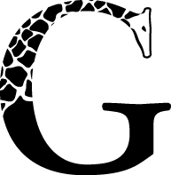

# ggraph
*/dʒiː.dʒɪˈrɑːf/*  (or g-giraffe)

[](https://travis-ci.org/thomasp85/ggraph)

### What it is
ggraph is an extension of ggplot2 tailored at plotting graph-like data 
structures (graphs, networks, trees, hierarchies...). It is not a graph plotting
framework that uses ggplot2 underneath, but rather an extension of the ggplot2 
API to make sense for graph data.

### Why not just use [*insert framework*]
You're certainly free to do that. My reason for developing this is that I feel
the rigor enforced by ggplot2 could benefit the graph visualization world, and
in addition, a lot of people are familiar with the ggplot2 API. Lastly it seems
a lot of frameworks are uniquely focused on creating node-edge diagrams; 
certainly the lowest denominator when it comes to graph visualization. While 
[D3.js](http://d3js.org) offers a lot of capabilities for different graph 
related visualizations, its API will seem foreign to a lot of people working in
R and, on top of that, its not straightforward to extract a static image based
on D3.js (safe for a screenshot).

### State
ggraph is currently in beta stage development. There is still a lot of
implementations that needs to be done, as well as some interface quirks that 
needs to be decided on.

### Installation
ggraph relies on functionality in the development version of ggplot2, so until
the next version of ggplot2 hits CRAN you'll need to install from GitHub. 
Furthermore ggraph is developed in concert with 
[ggforce](https://github.com/thomasp85/ggforce) so that general purpose 
functionality will appear in ggforce and be adapted to graph visualization in
ggraph (e.g geom_edge_bundle uses geom_bspline from ggforce underneath). ggforce
is still not on CRAN as it is undergoing fast development alongside ggraph so it
needs to be installed from GitHub too.

```r
if(!require(devtools)) {
  install.packages('devtools')
}
devtools::install_github('hadley/ggplot2')
devtools::install_github('thomasp85/ggforce')
devtools::install_github('thomasp85/ggraph')
```

### Examples
Currently ggraph understands dendrogram and igraph objects. Others might be
added in the future (please file an issue if there is a particular class you
want supported), but until then see if your object is convertible into one
of the two.

#### Dendrogram
```r
# Let's use iris as we all love the iris dataset
## Perform hierarchical clustering on the iris data
irisDen <- as.dendrogram(hclust(dist(iris[1:4], method='euclidean'), 
                                method='ward.D2'))
## Add the species information to the leafs
irisDen <- dendrapply(irisDen, function(d) {
  if(is.leaf(d)) 
    attr(d, 'nodePar') <- list(species=iris[as.integer(attr(d, 'label')),5])
  d
})

# Plotting this looks very much like ggplot2 except for the new geoms
ggraph(graph = irisDen, layout = 'dendrogram', repel = TRUE, circular = TRUE, 
       ratio = 0.5) + 
    geom_edge_elbow() + 
    geom_node_text(aes(x = x*1.05, y=y*1.05, filter=leaf, 
                       angle = nAngle(x, y), label = label), 
                   size=3, hjust='outward') + 
    geom_node_point(aes(filter=leaf, color=species)) + 
    coord_fixed() + 
    ggforce::theme_no_axes()
```


#### igraph
```r
# We use a friendship network
friendGraph <- graph_from_data_frame(highschool)
V(friendGraph)$degree <- degree(friendGraph, mode = 'in')
graph1957 <- subgraph.edges(friendGraph, which(E(friendGraph)$year ==1957), F)
graph1958 <- subgraph.edges(friendGraph, which(E(friendGraph)$year ==1958), F)
V(friendGraph)$pop.increase <- degree(graph1958, mode = 'in') > 
  degree(graph1957, mode = 'in')

ggraph(friendGraph, 'igraph', algorithm = 'kk') + 
  geom_edge_fan(aes(alpha = ..index..)) + 
  geom_node_point(aes(size = degree, colour = pop.increase)) + 
  scale_edge_alpha('Friends with', guide = 'edge_direction') + 
  scale_colour_manual('Improved', values = c('firebrick', 'forestgreen')) + 
  scale_size('# Friends') + 
  facet_wrap(~year) + 
  ggforce::theme_no_axes()
```


#### Other examples
##### Hierarchical Edge Bundles
```r
flareGraph <- graph_from_data_frame(flare$edges, vertices = flare$vertices)
importFrom <- match(flare$imports$from, flare$vertices$name)
importTo <- match(flare$imports$to, flare$vertices$name)
flareGraph <- treeApply(flareGraph, function(node, parent, depth, tree) {
  tree <- set_vertex_attr(tree, 'depth', node, depth)
  if (depth == 1) {
    tree <- set_vertex_attr(tree, 'class', node, V(tree)$shortName[node])
  } else if (depth > 1) {
    tree <- set_vertex_attr(tree, 'class', node, V(tree)$class[parent])
  }
  tree
})
V(flareGraph)$leaf <- degree(flareGraph, mode = 'out') == 0

ggraph(flareGraph, 'dendrogram', circular = TRUE) + 
  geom_edge_bundle(aes(colour = ..index..), data = gCon(importFrom, importTo), 
                   edge_alpha = 0.25) +
  geom_node_point(aes(filter = leaf, colour = class)) +
  scale_edge_colour_distiller('', direction = 1, guide = 'edge_direction') + 
  coord_fixed() +
  ggforce::theme_no_axes()
```


#### Treemaps
```r
# We continue with our flareGraph
ggraph(flareGraph, 'treemap', weight = 'size') + 
  geom_treemap(aes(filter = leaf, fill = class, alpha = depth), colour = NA) + 
  geom_treemap(aes(filter = depth != 0, size = depth), fill = NA) + 
  scale_alpha(range = c(1, 0.7), guide = 'none') + 
  scale_size(range = c(2.5, 0.4), guide = 'none') + 
  ggforce::theme_no_axes()
```


#### Animations
The code to produce the following is available as a 
[gist](https://gist.github.com/thomasp85/eee48b065ff454e390e1)


### Scope
The plan is that ggraph should support all types of graph related visualization.
For a start I'll draw inspiration from the vast library of graph visualizations 
available in D3.js, but if someone has a specific visualization approach they 
feel strongly for file an issue or a PR.

#### Roadmap
**Class support** *In order of importance*

- phylo from ape
- network from network
- graph from package graph
- data.tree from data.tree
- hypergraph from hypergraph (way down in the bottom along with all hypergraph
classes)

**Layouts**

- Unrooted tree layouts
- Sunburst / icicle
- Circle packing
- Hive plots
- Matrix plot
- Sankey diagram (maybe - undecided if it fits in ggraph)
- H-tree

**Connecions**

- geom_edge_trace
- geom_edge_connect

**geom_node_**

- density
- box

**geom_edge_**

- route (avoid node-edge collision)
- text
- tile (for matrix representations mainly)
- point (for matrix representations mainly)

**Other stuff**

- layout based on subset of edges
- Cut off edges before they reach node
